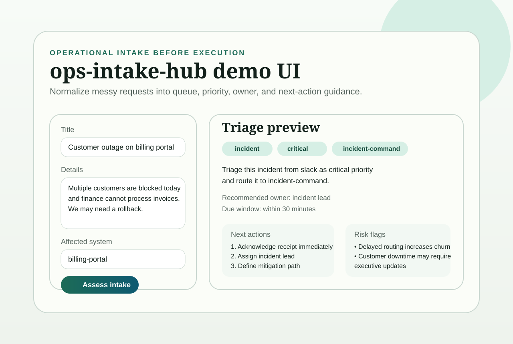

# ops-intake-hub

[](https://github.com/OfficialJCastillo/ops-intake-hub/actions/workflows/ci.yml)

A deterministic intake triage API for turning messy operational requests into queue, priority, ownership, deadline, and next-action guidance.

## Overview

`ops-intake-hub` is a narrow, applied portfolio project focused on the front door of execution. Instead of jumping straight into planning or automation, it normalizes incoming work so teams know what they are looking at first:

- accept a raw operational request
- classify the request into a triage category
- assign a priority and target queue
- recommend an initial owner and due window
- surface missing intake fields and operational risks
- return immediate next actions through a small FastAPI service

This repo is intentionally deterministic and local-first so its behavior stays inspectable, stable, and easy to review publicly.

## Demo Snapshot

Tiny browser demo preview:



## V1 Scope

- Local FastAPI service
- Deterministic intake triage with no hosted dependencies
- Triage categories for incidents, access requests, vendor requests, customer escalations, bug reports, and general operations
- Structured response schema with queue, owner, due window, next actions, missing fields, and risk flags
- Tiny browser demo at `GET /`
- Smoke tests and GitHub Actions CI

## Architecture

```text
ops-intake-hub/
├── app/
│   ├── api/
│   ├── schemas/
│   └── services/
├── tests/
├── README.md
├── requirements.txt
└── main.py
```

## Example Workflow

1. Submit a raw request such as "Customer outage on billing portal."
2. The service classifies the request into a category such as `incident` or `access_request`.
3. It returns a target queue, urgency level, due window, recommended owner, missing fields, and next actions.
4. A team can then route the item into planning, ticketing, or incident handling with cleaner structure.

## How To Run

```bash
python -m venv .venv
source .venv/bin/activate
pip install -r requirements.txt
uvicorn main:app --reload
```

Open the tiny browser demo after starting the server:

```text
http://127.0.0.1:8000/
```

## API Endpoints

- `GET /` (tiny demo UI)
- `GET /health`
- `POST /triage/assess`

## Example Response

```json
{
  "triage_category": "incident",
  "priority": "critical",
  "queue": "incident-command",
  "recommended_owner": "incident lead",
  "due_window": "within 30 minutes",
  "summary": "Triage this incident from slack as critical priority and route it to incident-command.",
  "next_actions": [
    "Acknowledge receipt immediately and start incident coordination.",
    "Assign an incident lead and confirm current impact."
  ],
  "missing_fields": [],
  "risk_flags": [
    "Delayed routing will increase operational churn."
  ]
}
```

## Tiny Demo UI

The root page provides a one-screen intake form for:

- title
- details
- source channel
- requester team
- affected system

It then renders the live structured triage response without needing Postman or a separate frontend.

## Design Notes

- The system is intentionally deterministic so routing behavior is easy to inspect and discuss.
- This project complements `workflow-copilot` by handling intake normalization before deeper planning.
- It complements `rag-eval-lab` by showing applied operational product thinking rather than evaluation infrastructure.

## GitHub Setup Notes

Suggested repo description:

`Deterministic intake triage API for routing operational requests into the right queue, owner, and response window.`

Suggested topics:

- `operations`
- `triage`
- `fastapi`
- `python`
- `workflow`
- `intake`
- `routing`
- `api`

## Roadmap

- add batch triage for queued intake feeds
- add lightweight SLA policy configuration
- add adapter examples for GitHub issues, Slack forms, and email-to-JSON intake
- add persistence for reviewed or resolved intake decisions
